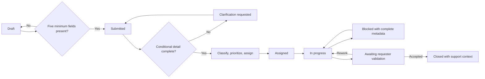
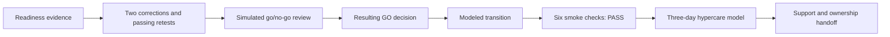

# Synthetic Internal Service Request Workflow Transition

> **Synthetic, fictional, platform-neutral work sample—not a real client or production implementation.**

## The problem

A fictional internal service-request process begins in email and a shared tracker. Minimum submission content is mixed with later clarification, routing decisions vary, accountable ownership can become unclear, material updates lack a complete record, and closure can lose context needed by support.

The work sample turns that ambiguity into a reviewable lifecycle model. It demonstrates implementation-analysis judgment: separate intake decisions, explicit configuration rules, traceable readiness evidence, bounded response to findings, rollback logic, role enablement, and reusable support context.

## Core decisions

Stage A keeps a request in `Draft` until summary, category, business impact, requested outcome, and requester role are present. Stage B begins only after `Submitted`; it reviews urgency, requested-by timing, category-specific detail, and supporting constraints. Missing conditional detail creates clarification, and every response triggers a fresh completeness calculation.

Four categories map to matching skill contexts. Priority is evaluated Critical through Low, and the first satisfied rule controls. The coordinator retains responsibility when no match exists; after assignment, exactly one Fulfiller is accountable. Clarification, blocker, ownership, timing, validation, and closure changes retain a complete static communication record. Requester validation precedes closure, and closure retains resolution and handoff context.

**Text alternative:** Missing minimum content retains Draft. Complete Stage-A content permits Submitted. Stage B loops insufficient conditional detail through clarification and a fresh calculation, then routes to one owner. Fulfillment records blockers, requester validation, closure, and support context.

## Representative request

A fictional Requester asks for a department-level exception view in a recurring operations report. One team relies on manual review but can continue through a workaround. All five minimum fields are present, so the request reaches `Submitted`. The coordinator finds the reporting period and exception-filter definition missing and requests clarification.

The Requester supplies `Current reporting cycle` and `Include records with no accountable owner or state=Blocked`. Completeness is recalculated. One affected team, an available workaround, and a `T+3` requested-by window produce Medium priority, and the category maps to the Data/Reporting modeled route. One Fulfiller becomes accountable.

A field-definition ambiguity later creates `Blocked` with owner, reason, next action, and `T+1` update label. After resolution, the modeled outcome enters requester validation, is accepted, and closes with resolution context, a support reference, and a handoff note.

## Findings and retest judgment

Eight synthetic UAT cases cover both intake stages, deterministic routing, assignment and reassignment, invalid transitions and blockers, material communication, requester validation, and retained handoff context. Six initially pass. Two expose bounded design problems: a stale Stage-B completeness result after clarification, and direct closure without a requester decision.

The rules are corrected. Both retests pass, producing eight final synthetic passes. These are modeled observations in static evidence—not software execution or real user testing.

## Readiness, rollback, and transition

Passing retests are required before the simulated go/no-go review. The review produces the GO decision that governs transition; that decision is not circular evidence required to produce the review result. Six explicit smoke checks pass: submission/reference, routing/priority, single owner, transition/blocker metadata, requester-validation closure, and support-reference retention.

Rollback remains concrete: a failed required check pauses the modeled transition, restores the frozen baseline, preserves evidence, records a simulated communication, and requires revalidation. Because the six modeled checks pass, rollback is not invoked.

**Text alternative:** Readiness evidence and two passing retests precede the simulated go/no-go review. Its resulting GO decision governs transition. Six smoke checks pass, followed by three modeled support days and an ownership handoff review.

## Enablement and support

Role guidance describes the changed behavior for Requester, Request Coordinator, Fulfiller, and Support Analyst. Three simulated support cases map one-to-one to three runbooks: Stage-B recovery, requester-validation/closure recovery, and closure-context/ownership handoff. By Day 3, the cases are closed and no unresolved Critical or High item remains.

## Curated proof path

1. [Scenario and configuration](docs/scenario-and-configuration.md)
2. [Requirements, acceptance, and readiness](evidence/needs-requirements-acceptance-readiness.csv)
3. [RAID and decisions](evidence/raid-decisions.csv)
4. [Synthetic UAT](evidence/uat-cases-results.csv) and [defect/retest evidence](evidence/defect-retests.csv)
5. [Cutover and smoke checks](evidence/cutover-go-no-go-rollback-smoke-checks.csv)
6. [Role guidance](docs/role-based-quick-reference.md) and [support runbooks](docs/support-runbooks-and-handoff.md)

## Limitations

This work demonstrates synthetic implementation-analysis judgment, traceability, test design, retest decisions, rollback logic, enablement, and support-transition thinking. It does not establish real stakeholder participation, implementation, configuration, platform administration, integration, UAT, deployment, go-live, training, hypercare, support ownership, SLA performance, adoption, savings, ROI, or other business outcomes. See [Limitations](LIMITATIONS.md).

